# Image Processing Project


## The Dataset

We use BDD100K, a large-scale driving dataset with 70K training and 10K validation images. Every image comes from a dashboard camera and has multiple annotations:

- Bounding boxes for cars, people, trucks, etc.
- Drivable area polygons showing where the car can drive
- Scene labels like city street, highway, or residential

This means we can run three completely different tasks on the same images.

---

## The Tasks

### Task 1: Object Detection (YOLOv8n)
Find and label objects in the image. We use a pretrained YOLOv8n, a deep learning model. It knows how to detect people, cars, buses, trucks, motorcycles, and traffic lights.

### Task 2: Drivable Area Segmentation (SegFormer-b0)
Label every pixel as road or not road. We use SegFormer-b0, a deep learning model pretrained on another driving dataset, so it already understands what a road looks like.

### Task 3: Scene Classification (HOG + SVM)
Classify the entire image as city street, highway, or residential. We extract HOG features which capture edge patterns and feed them to an SVM classifier trained on BDD100K labels.


---

## The Distortions

We apply three types of image degradation. All of them preserve image geometry, so the ground truth annotations stay valid.

| Distortion | What it simulates | How it works |
|------------|-------------------|-------------|
| Gaussian Noise | Camera sensor noise | Random pixel values added to the image |
| Motion Blur | Camera or vehicle movement | Directional kernel smears the pixels |
| Rain | Rainy weather | Semi-transparent streaks drawn over the image |

We measure severity using SNR in dB.

---

## The Enhancements

Each distortion is paired with a classical technique designed to undo the damage:

| Distortion | Enhancement | How it helps |
|------------|-------------|-------------|
| Noise | Non-local means denoising | Averages similar patches to smooth noise while keeping edges |
| Motion Blur | Unsharp mask | Amplifies edges to recover some sharpness |
| Rain | Median blur + bilateral filter | Median removes streaks, bilateral smooths the result |


---

## The Metrics

| Task | Metric | Why |
|------|--------|-----|
| Detection | mAP0.5 | Captures both correct detections and false alarms |
| Detection | Avg confidence | Shows how certain the model is, even when mAP looks ok |
| Segmentation | Pixel IoU | How much predicted road overlaps with actual road |
| Segmentation | Precision | Whether the model is predicting road where there is none |
| Classification | Accuracy | How often the model gets the scene right |

---

## The Experiment

We follow five steps:

1. **Baseline**: run each model on clean images
2. **Distortion**: apply each distortion and measure the drop
3. **Enhancement**: enhance the distorted images and measure recovery
4. **Fine-tuning**: retrain the DL models on distorted images (3 epochs) to see if they can adapt
5. **SNR sweep**: vary distortion intensity across 7 levels and plot metric vs SNR

All evaluations are performed on **100 validation images** from BDD100K.

---

## Results

### Distortion Samples

First, let's see what the distortions actually look like on real images. Each row shows clean, distorted, and enhanced side by side on three different images.

#### Noise

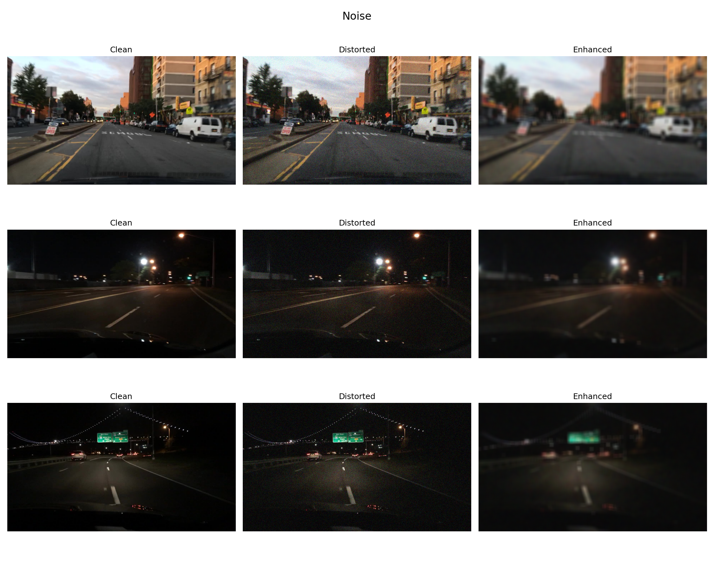

The noise makes the image grainy, especially in darker regions. The denoising step cleans up most of it, though some fine detail is lost in the process.

#### Motion Blur

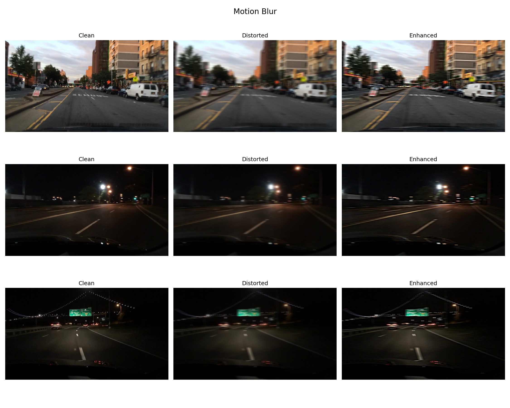

Everything is smeared horizontally. Signs become unreadable and small objects blend into the background. The unsharp mask brings back some edge contrast, but the lost detail can't be fully recovered since the information was destroyed by the blur kernel.

#### Rain

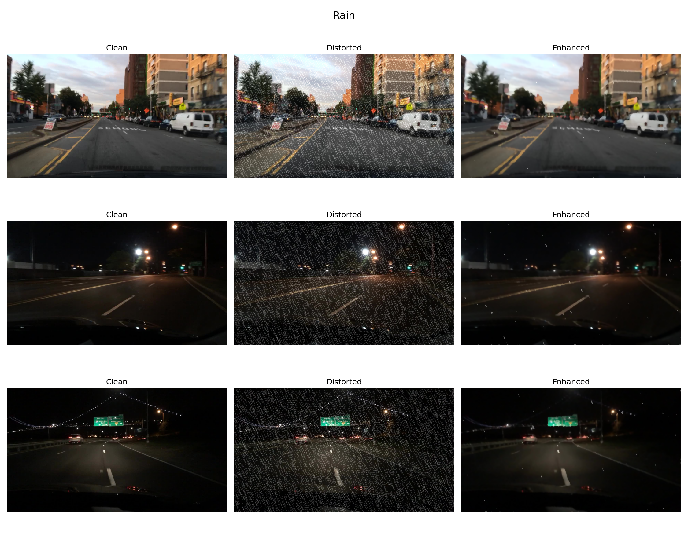

Rain streaks cover large parts of the image. The median + bilateral filter removes most of the visible streaks, though in darker areas some traces remain.

---

### Object Detection (YOLOv8)

#### Ground Truth

This shows a sample image with the human-annotated bounding boxes drawn in green. These are the objects we expect YOLOv8 to find.

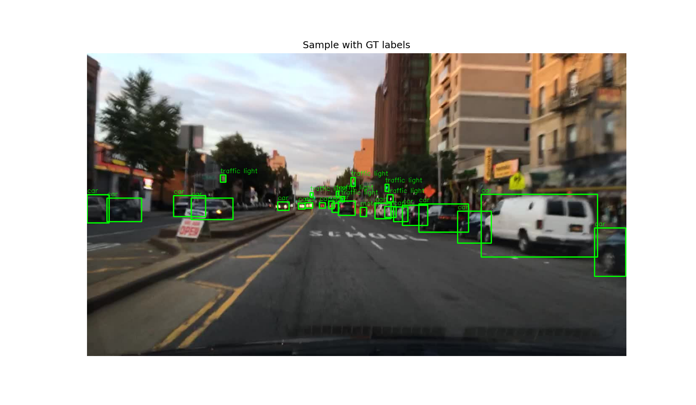

#### Clean vs Distorted vs Enhanced

Each row applies a different distortion. Left column is clean with YOLOv8 predictions, middle is distorted, right is after enhancement. The fourth row stacks all three distortions together.


On clean images the model finds most objects confidently. Under noise and rain, some detections vanish or drop in confidence. Motion blur is the most destructive: the model barely finds anything. Enhancement brings some detections back, but the recovery is partial.

#### Baseline Per-Class AP

This chart shows per-class average precision on clean images before any distortion is applied. The red dashed line is the overall mAP0.5.

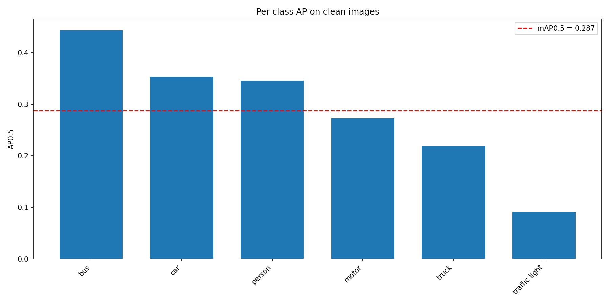

Larger objects like buses and cars score highest. Smaller or less frequent objects like traffic lights and motorcycles are harder to detect even on clean images.

#### mAP0.5 vs SNR (Performance per Distortion Level)

These three plots show how detection performance changes as distortion gets stronger. Solid = distorted, dashed = enhanced, dotted = fine-tuned.

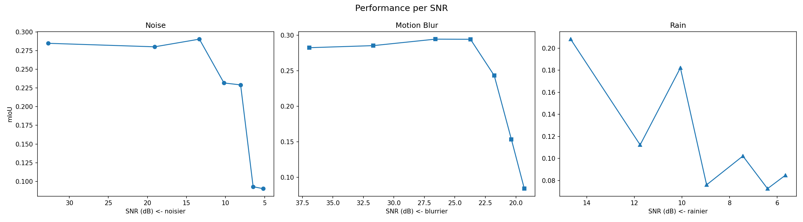

For noise with high severity, the enhanced line stays above the distorted line, confirming that denoising helps. For motion blur, all three lines are close together, meaning neither enhancement nor fine-tuning managed to fix the damage. For rain, fine-tuning gives a small advantage, and enhancment gives a big adventage at lower SNR.

#### mAP0.5 Comparison (Clean vs Distorted vs Enhanced vs Fine-tuned)

This is the summary chart. Four bars per distortion showing the overall mAP0.5 for each condition.

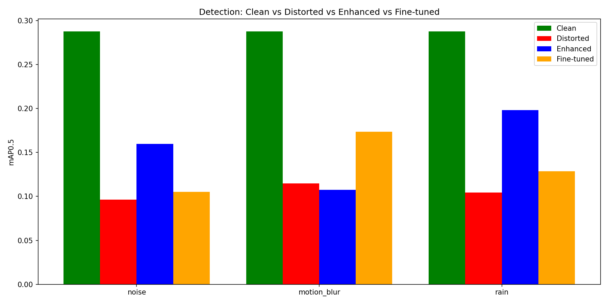

The gap between green (clean) and red (distorted) shows how much damage each distortion causes. Blue (enhanced) recovers part of it, with the biggest improvement on rain and noise. Orange (fine-tuned) is competitive with enhancement and sometimes better. We can see that noise and rain benefit fron enhancment while motion blur benefits only from fine-tuning.

#### Per-Class AP0.5 Comparison

These break down the comparison chart by object class for each distortion type.

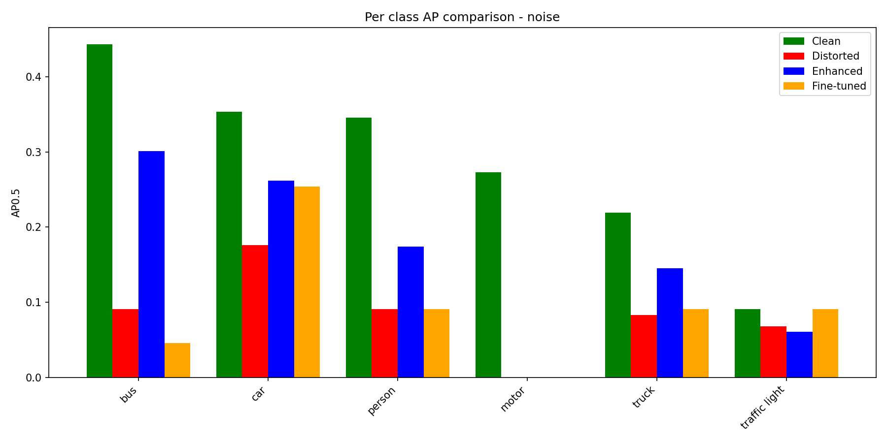
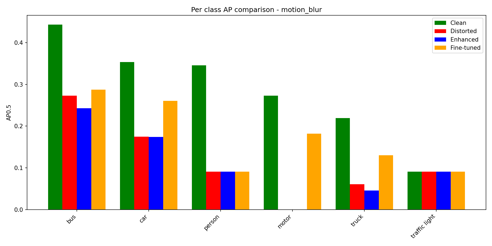
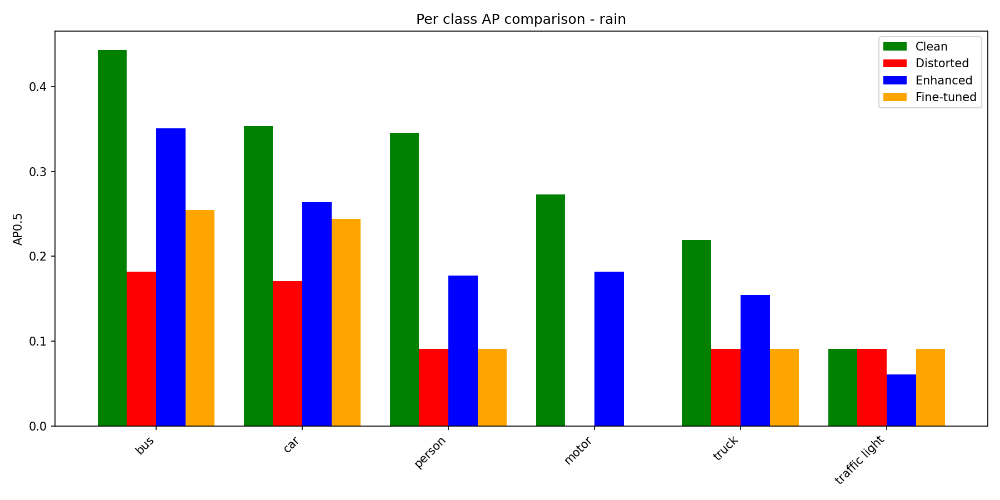

Not all classes are affected equally. Enhancement helps most for larger objects that have enough pixels to benefit from denoising or deraining. And as we can see motion blur doesn't benefit much from enhancment.

#### Average Detection Confidence (Clean vs Distorted vs Enhanced vs Fine-tuned)

This chart shows the average confidence of all predictions, grouped by distortion.

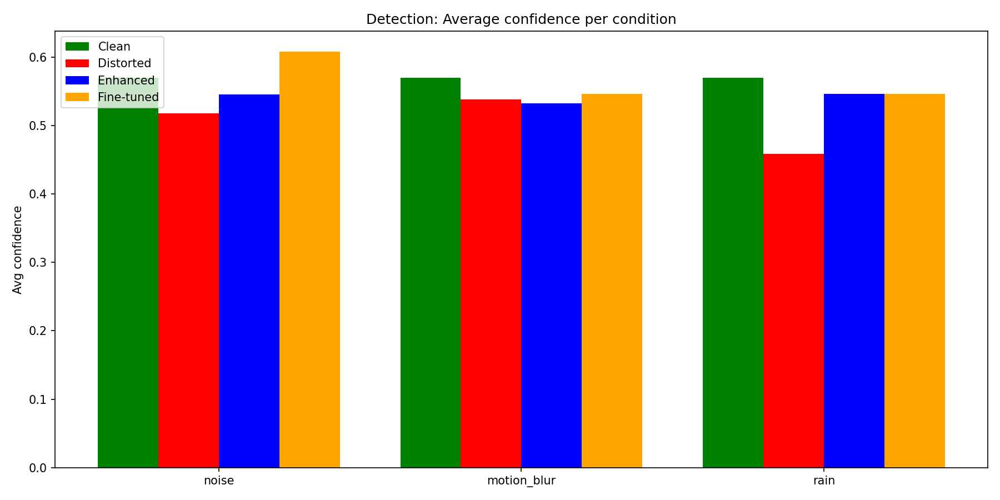

Interestingly, confidence stays relatively stable compared to mAP. This tells us something important: the model doesn't just make fewer predictions, it also becomes less sure about the ones it does make. Rain causes the biggest confidence drop. Fine-tuning on noise actually pushes confidence above the clean baseline which may be an indecator of overfitting.

---

### Drivable Area Segmentation (SegFormer)

#### Ground Truth

This shows a sample image with the annotated drivable area overlaid in green. This is what the segmentation model should predict.

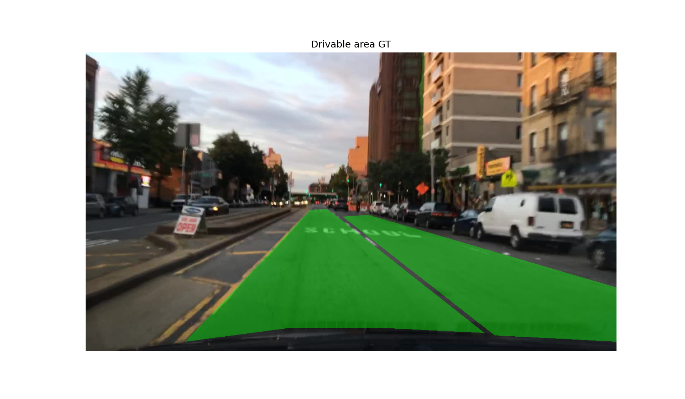

#### Clean vs Distorted vs Enhanced

Each row applies a different distortion to the same image. The green overlay is the model's predicted road area.

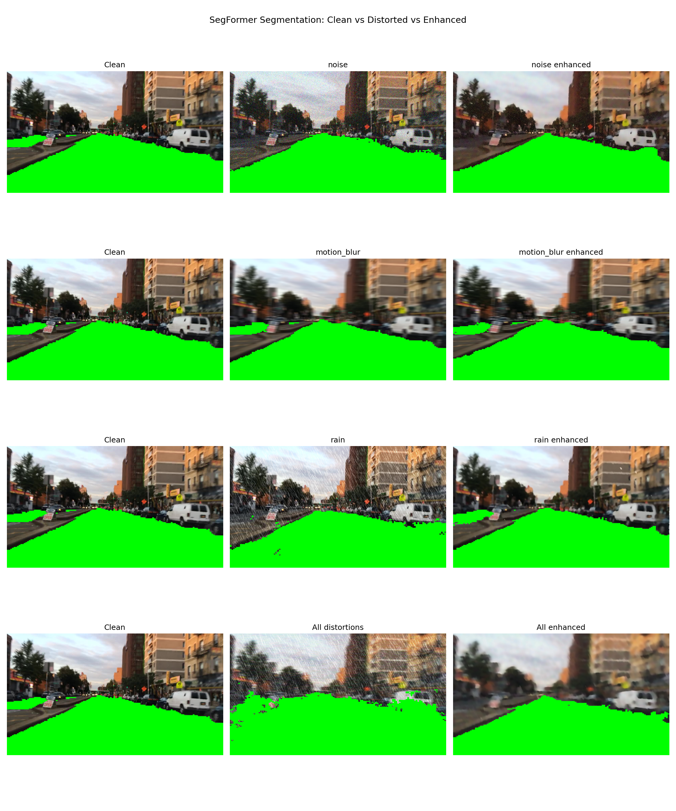

On clean images the model captures the road surface well. Under noise, the prediction becomes patchy. Motion blur doesn't change much. After enhancement, the predictions generally look closer to the clean version.

#### IoU vs SNR (Performance per Distortion Level)

How segmentation IoU changes as distortion gets stronger. Solid = distorted, dashed = enhanced, dotted = fine-tuned.

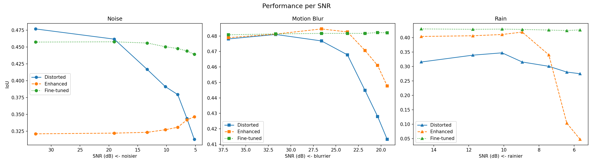

The fine-tuned models (dotted) maintain stable IoU across severity levels, showing that adapting to distorted data helps the model stay robust even as image quality drops. Enhancment worked good for motion blur but a bit less predictable for Rain and Noise.

#### IoU Comparison (Clean vs Distorted vs Enhanced vs Fine-tuned)

Four bars per distortion showing overall pixel IoU.

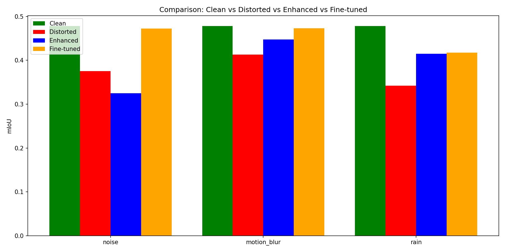

We can see that genrally fine tuning performed the absolute best getting us closer to clean image results, enhancment again worked good for motion blur and rain.

#### Precision (Clean vs Distorted vs Enhanced vs Fine-tuned)

What fraction of the predicted road is actually road, grouped by distortion.

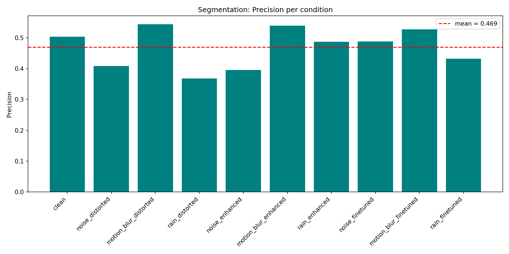

Precision tells a different story than IoU. It tells us how accurate the model performed, we can see that like we expect from motion blur it wouldn't change much on how precise the model predicts the road as it doesn't shift as much.

---

### Scene Classification (HOG + SVM)

#### Sample Images

Three examples from each scene class. City streets have dense buildings and traffic, highways are open with clear lane markings, and residential areas have houses and quieter roads.

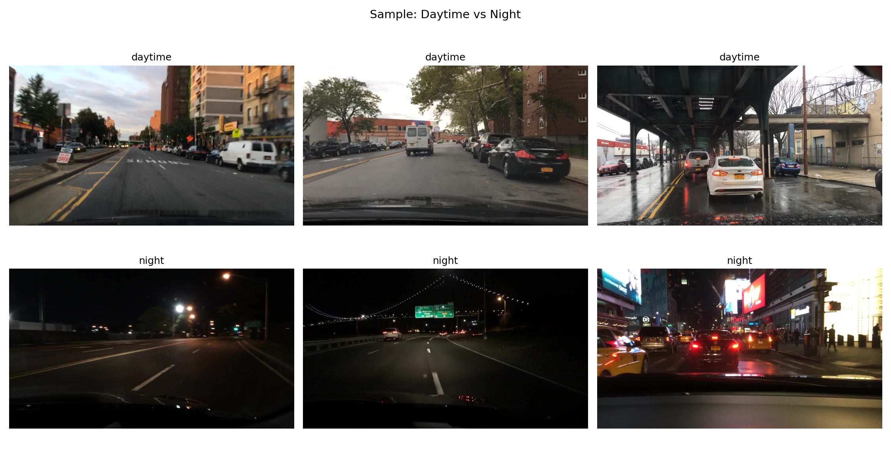

#### HOG Feature Visualization

These show the HOG features extracted from clean, distorted, and enhanced images. HOG captures edge directions and is what the SVM uses to classify scenes.

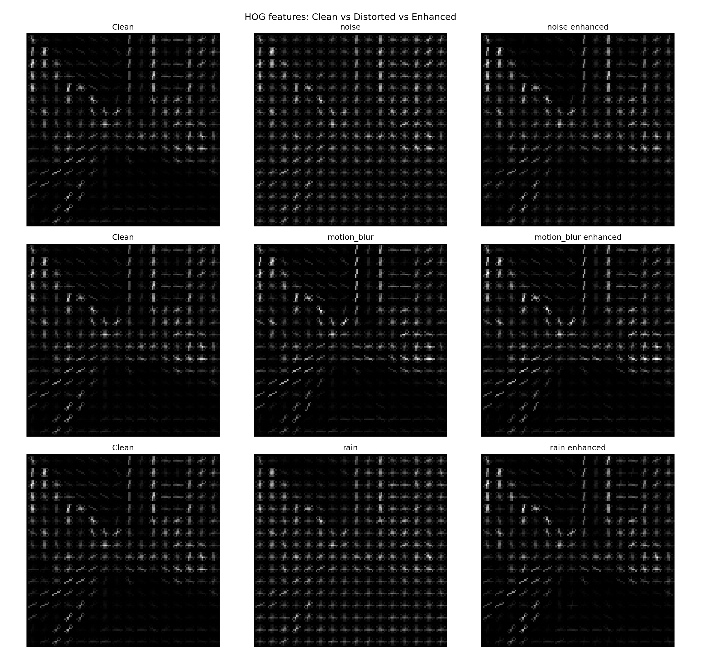

We can tell that for most of the noises the enhanced version looks somewhat similar to the clean version which is a good indicator.

#### Accuracy vs SNR (Performance per Distortion Level)

These plots show how classification accuracy changes with increasing distortion severity. Solid = distorted, dashed = enhanced.

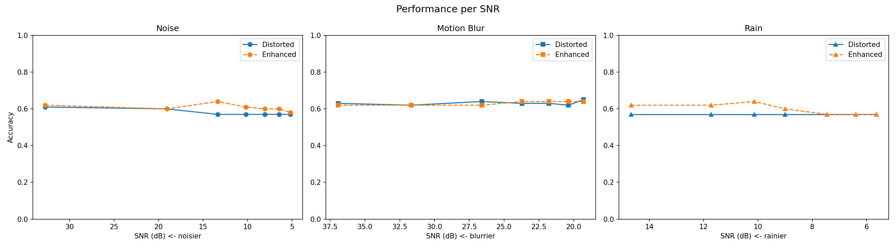

Classification turns out to be more robust than detection. This makes sense: HOG captures global edge statistics rather than fine object details, so moderate distortions don't change the overall scene structure much. Noise has the biggest impact, while motion blur barely affects accuracy.

#### Accuracy Comparison (Clean vs Distorted vs Enhanced)

Overall accuracy for clean, distorted, and enhanced across all distortions.

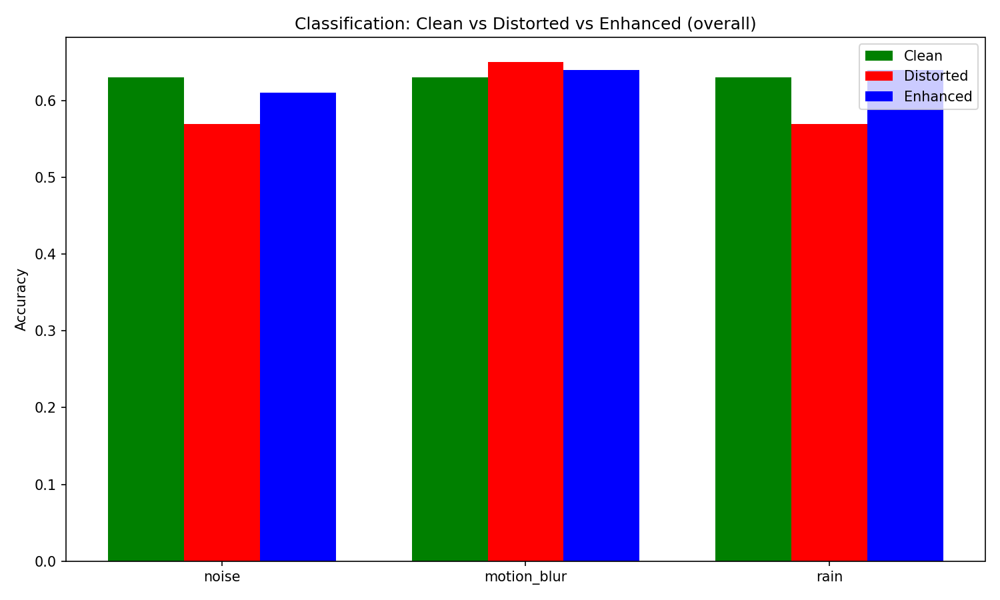

The accuracy drop is much smaller than what we saw in detection. Noise and rain reduce accuracy by a few percent, and enhancement recovers most of it. Motion blur barely changes accuracy at all like we would expect.

#### Per-Scene Accuracy Comparison

Accuracy broken down by scene class for each distortion.

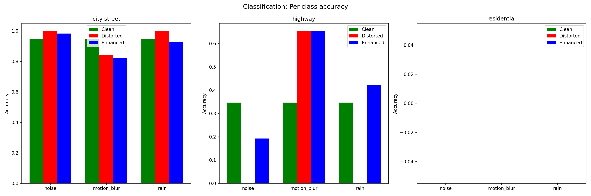

City streets are classified reliably under all conditions thanks to their distinctive features. Highway accuracy varies more since open roads have fewer HOG features but enhancement does seem to work well. Residential scenes are the hardest to classify in general as they look similar to city streets and the model probably couldn't differ between the 2 using HOG and SVM.

---

## Results Tables

### Object Detection: Overall mAP0.5

| Condition | Noise | Motion Blur | Rain |
|-----------|-------|-------------|------|
| Clean | 0.29 | 0.29 | 0.29 |
| Distorted | 0.08 | 0.12 | 0.09 |
| Enhanced | 0.16 | 0.11 | 0.19 |
| Fine-tuned | 0.09 | 0.17 | 0.13 |

### Object Detection: Per-Class AP0.5 (Noise)

| Class | Clean | Distorted | Enhanced | Fine-tuned |
|-------|-------|-----------|----------|------------|
| bus | 0.44 | 0.09 | 0.30 | 0.05 |
| car | 0.35 | 0.18 | 0.26 | 0.26 |
| person | 0.35 | 0.09 | 0.17 | 0.09 |
| motor | 0.27 | 0.00 | 0.00 | 0.00 |
| truck | 0.22 | 0.08 | 0.15 | 0.09 |
| traffic light | 0.09 | 0.07 | 0.06 | 0.10 |

### Object Detection: Per-Class AP0.5 (Motion Blur)

| Class | Clean | Distorted | Enhanced | Fine-tuned |
|-------|-------|-----------|----------|------------|
| bus | 0.44 | 0.27 | 0.24 | 0.29 |
| car | 0.35 | 0.17 | 0.17 | 0.26 |
| person | 0.35 | 0.09 | 0.09 | 0.09 |
| motor | 0.27 | 0.00 | 0.00 | 0.18 |
| truck | 0.22 | 0.06 | 0.05 | 0.13 |
| traffic light | 0.09 | 0.09 | 0.09 | 0.09 |

### Object Detection: Per-Class AP0.5 (Rain)

| Class | Clean | Distorted | Enhanced | Fine-tuned |
|-------|-------|-----------|----------|------------|
| bus | 0.44 | 0.09 | 0.44 | 0.25 |
| car | 0.35 | 0.17 | 0.27 | 0.24 |
| person | 0.35 | 0.09 | 0.18 | 0.09 |
| motor | 0.27 | 0.00 | 0.00 | 0.00 |
| truck | 0.22 | 0.09 | 0.19 | 0.09 |
| traffic light | 0.09 | 0.09 | 0.07 | 0.09 |

### Drivable Area Segmentation: IoU

| Condition | Noise | Motion Blur | Rain |
|-----------|-------|-------------|------|
| Clean | 0.48 | 0.48 | 0.48 |
| Distorted | 0.37 | 0.41 | 0.35 |
| Enhanced | 0.33 | 0.45 | 0.41 |
| Fine-tuned | 0.45 | 0.48 | 0.39 |

### Drivable Area Segmentation: Precision

| Condition | Noise | Motion Blur | Rain |
|-----------|-------|-------------|------|
| Clean | 0.50 | 0.50 | 0.50 |
| Distorted | 0.40 | 0.55 | 0.37 |
| Enhanced | 0.39 | 0.54 | 0.49 |
| Fine-tuned | 0.50 | 0.49 | 0.46 |

### Scene Classification: Overall Accuracy

| Condition | Noise | Motion Blur | Rain |
|-----------|-------|-------------|------|
| Clean | 0.63 | 0.63 | 0.63 |
| Distorted | 0.57 | 0.65 | 0.57 |
| Enhanced | 0.61 | 0.64 | 0.60 |

### Scene Classification: Per-Class Accuracy

#### City Street

| Condition | Noise | Motion Blur | Rain |
|-----------|-------|-------------|------|
| Clean | 0.95 | 0.95 | 0.95 |
| Distorted | 1.00 | 0.85 | 0.95 |
| Enhanced | 0.98 | 0.80 | 0.90 |

#### Highway

| Condition | Noise | Motion Blur | Rain |
|-----------|-------|-------------|------|
| Clean | 0.35 | 0.35 | 0.35 |
| Distorted | 0 | 0.7 | 0.00 |
| Enhanced | 0.17 | 0.7 | 0.45 |

#### Residential

| Condition | Noise | Motion Blur | Rain |
|-----------|-------|-------------|------|
| Clean | 0.00 | 0.00 | 0.00 |
| Distorted | 0.00 | 0.00 | 0.00 |
| Enhanced | 0.00 | 0.00 | 0.00 |

---

## Summary

Here is what we learned from running the full pipeline:

- **Motion blur** is the hardest distortion to deal with. Enhancement (unsharp mask) barely helps because the information is already gone. However, fine-tuning shows real improvement here, the models learn to work with blurry input when trained on it.

- **Noise** responds well to enhancement. Non-local means denoising consistently recovers performance across all three tasks. Fine-tuning also helps but enhancement alone already does most of the work.

- **Rain** is somewhere in between. The median + bilateral filter cleans up the streaks and recovers a decent amount of performance. Fine-tuning gives a small additional boost on top of that.

- **Classical methods (HOG + SVM)** are more stable under distortion than expected. Motion blur barely affects classification accuracy, probably because HOG captures global edge patterns that don't change much from blur. But the model has trouble telling residential scenes apart from city streets since they look similar at the feature level.

- **Detection confidence** doesn't always match mAP. The model can still make predictions under distortion, but it becomes less confident about them. This is useful to know because in a real system you might want to flag low-confidence detections rather than trust them blindly.

- **Segmentation precision** can stay high even when IoU drops. This means the model predicts less road overall rather than predicting road in wrong places, which is arguably a safer failure mode for a self-driving system.

Overall, the best recovery strategy depends on the distortion: enhancement works for noise and rain, fine-tuning works better for motion blur.

---

## Project Structure

```
Image-processing/
├── main.py              # Entry point (python main.py [task])
├── distortions.py       # Noise, motion blur, rain
├── enhancement.py       # Denoise, deblur, derain
├── detection.py         # YOLOv8 + mAP
├── segmentation.py      # SegFormer + IoU
├── classification.py    # HOG + SVM + accuracy
├── requirements.txt
├── README.md
├── dataset/             # BDD100K (not included)
│   ├── train/
│   ├── val/
│   └── test/
└── results/             # Generated figures
    ├── detection/
    ├── segmentation/
    └── classification/
```

---

## How to Run

Download BDD100K from https://www.kaggle.com/datasets/marquis03/bdd100k and place it in `dataset/`.

```bash
# Clone the repo
git clone https://github.com/AshRider1/Image-processing.git
cd Image-processing

# Install dependencies
pip install -r requirements.txt

# Run everything
python main.py

# Run a specific task
python main.py detection
python main.py segmentation
python main.py classification
python main.py distortions
```
